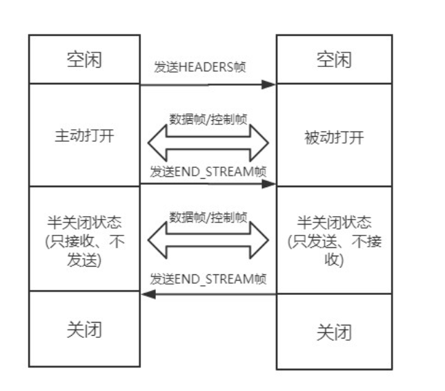

##### HTTP报文结构是怎样的

请求端（客户端）的报文叫做请求报文，响应端（服务器端）的叫做响应报文。

HTTP报文本身是由多行数据构成的字符串文本。

HTTP报文大致可分为**报文首部**和**报文主体**


其实可以分为四个部分：`起始行 + 头部 + 空行 + 实体`

而请求报文和响应报文又是有区别的，下面进行分析：

**起始行**


我们可以看到：

请求报文中的**请求行是**由：请求方法，URI以及通信协议版本构成

响应报文中的**响应行**是由：通信协议版本，状态码以及原因构成

**空行**

空行还是很重要的，是用来分开`头部`和`实体`的

如果说，故意再头部加一个空行，那会导致空行后面的内容全部视为实体

**请求头**

这里面的信息量很大，涉及到HTTP很多特性，通过后面的学习慢慢进行了解。

**实体**

就是具体的数据了，也就是body部分，请求报文对应请求体，响应报文对应响应体

##### HTTP的请求方法

**有哪些请求方法？**

- GET：通常用来获取资源
- HEAD：获取资源的元信息
- POST：提交数据
- PUT：修改数据
- DELETE：删除资源
- CONNECT：建立连接隧道，用于代理服务器
- OPTIONS：列出可对资源实行的请求方法，用来跨域请求
- TRACE：追踪请求-响应的传输路径

**GET和POST有什么区别？**

- 从缓存角度：浏览器会对GET请求进行缓存，而POST默认不会进行缓存
- 从编码角度：GET请求只能进行URL编码，之呢个接收ASCll字符，而POST没有细致
- 从参数角度：GET请求的请求参数一般放在URL上，因此不安全，而POST请求放在请求体中，更适合传输敏感数据
- 从幂等性角度：GET请求是幂等的，也就是说，请求多次与请求一次得到的结果是一样的，而POST不是
- 从TCP角度：GET请求会把请求报文一次性发出去，而POST会分为两个TCP数据包，先发送header部分，如果服务器响应100，然后再发送body部分。

##### HTTP状态码

- 1xx：表示目前是协议处理的中间状态，还需要后续操作
  - 100（continue）：继续请求
  - 101（Switching Protocols）：在HTTP升级为WebSocket的时候，如果服务器同意变更，就会发送状态码101
- 2xx：表示成功状态
  - 200（OK）：请求成功，通常在响应体中放有数据
  - 204（No Content）：请求成功，但是响应体中没有数据
- 3xx：重定向状态，资源位置发生变动，需要重新请求
  - 301（Moved Permanently）：永久重定向，比如说网站从HTTP升级到HTTPS，以前的站点再也不用了，就会返回301，这个时候，浏览器会默认做缓存优化，在第二次访问的时候会自动访问重定向后的那个地址
  - 302（Found）：临时重定向，比如说，当我们进入一个网站时，服务器端检测到我们没有登录，就会自动定向到登录界面，浏览器并不会对此进行缓存优化，下次访问的时候还是原来的地址。
- 4xx：请求报文有误
  - 400（Bad Request）：这个可能是请求的语义有误或者参数有误
  - 403（Forbidden）：这个挺常见的，禁止访问
  - 404（Not Found）：资源未找到
  - 405（Method Not Allowed）：请求方法不被服务器允许
  - 406（Not Acceptable）：资源无法满足客户端的条件
  - 408（Request Timeout）：服务器等待了太长时间，超时了
- 5xx：服务器端错误
  - 503（Service Unavailable）：服务器繁忙，这个估计大家经常见到吧，抢课的时候太多人同时访问，就会出现这个。

##### Accept系列字段解析

对于Accept系列字段的介绍分为四个部分：数据格式，压缩方式，支持语言和字符集。


**数据格式**

当收到服务器端发送的数据后，客户端如何来辨别各种数据的格式呢？

服务器端会在响应头上使用`Content-Type`字段来告诉客户端，当然，客户端发送请求时也可以在请求头上的`Accept`字段告诉服务器端自己想要收到特定类型的数据。

具体而言，这两个字段的取值可以分为以下几类：

- text：text/html，text/plain，text/css等
- image：image/gif，image/jpeg，image/png等
- audio/video：audio/mpeg，video/mp4等
- application：application/json，application/javascript，application/pdf，application/octetstream

**压缩方式**

一般这些数据都会进行编码压缩的，采取的方式就体现在了发送端的`Content-Encoding`字段上，以及接收端的`Accept-Encoding`字段上

**支持语言**

```javascript
//发送端
Content-Language: zh-CN, zh, en
//接收端
Accept-Language: zh-CN, zh, en
```

**字符集**

在接收端对应为`Accept-Charset`，指定可以接受的字符集，而在发送端直接放在了`Content-Type`上面

```javascript
// 发送端
Content-Type: text/html; charset=utf-8
// 接收端
Accept-Charset: charset=utf-8
```

##### HTTP的队头阻塞问题

**什么是HTTP队头阻塞？**

从前面的小节可以知道，HTTP传输是基于`请求-应答`的模式进行的，报文必须是一发一收，但是，里面的任务被放在一个任务队列中串行执行，一旦队首的请求处理太慢，就会阻塞后面请求的处理，这就是著名的`HTTP队头阻塞`问题。

**并发连接**

对于一个域名允许分配多个长连接，那么相当于增加了任务队列，不至于一个队列阻塞其它所有任务，在Chrome浏览器中可以并发6个连接。

但其实，即使提高了并发连接，还是不能满足人们对性能的需求。

**域名分片**

一个域名可以并发6个长连接，那么如果多分几个域名，那不是可以增加大量的长连接，同一个域名下可以分出非常多的二级域名，而它们都指向同样的一台服务器，能够并发的长连接数更多了，更好地解决了队头阻塞的问题。

##### Cookie

**简介：**

前面说到了HTTP是一个无状态协议，每次http请求都是独立的，默认不需要保留状态信息，但是，有时候我们又需要保存一些状态，例如登录。

为此，HTTP引入了Cookie，Cookie本质上就是浏览器里面存储的一个很小的文本文件，内部以键值对的方式进行存储。向同一个域名下发送请求，都会携带相同的Cookie，服务器端也可以通过响应头中的`Set-Cookie`字段来对客户端写入Cookie。

**生存周期：**

Cookie的有效期可以通过Expires和Max-Age两个属性来设置

**作用域：**

Domain和Path，给Cookie板顶了域名和路径，在发送之前，若发现当前域名和路径与这两个属性不相同，则请求时不会携带Cookie。

**安全相关：**

如果带上`Secure`字段，只能通过HTTPS传输Cookie

如果带上`HttpOnly`，那么只能通过HTTP协议传输，不能通过JS获取。

相应的，对于CSRF攻击，也有`SameSite`属性，其有三个值可以设置：

- Strict：浏览器完全禁止第三方请求携带Cookie
- Lax：这个稍微宽松一点，只能在get方法提交表单，或者a标签发送get请求的情况下携带Cookie。
- None：默认模式，请求会自动带上Cookie

##### HTTP/2的改进

由于HTTPS在安全方面已经做的非常好了，因此，HTTP改进的关注点放在了性能方面，对于性能的提升主要体现在以下两点：

- 头部压缩
- 多路复用

**头部压缩**

在HTTP/1.1版本中，请求体一般会有响应的压缩编码过程，通过Content-Encoding头部字段来指定，但是，设计者后来发现，请求字段复杂的时候，尤其对于GET请求，请求报文几乎全是请求头，因此，HTTP/2针对头部字段，也采用了对应的压缩算法—HPACK，对请求头进行压缩。

HPACK算法的主要亮点有两个：

- 首先是在服务器和客户端之间建立哈希表，将用到的字段存放在这张表中，在传输过程中，只需要传输对应的索引值就行了，接收端拿到值后，对照着索引表就可以查到对应的字段。
- 其次，对于整数和字符串部分进行哈夫曼编码，哈夫曼编码的原理就是先将所有出现的字符建立一张索引表，然后让出现次数多的字符对应的索引尽可能的短，传输的时候也是传输这样的索引序列，可以达到非常高的压缩率。

> 同时，HTTP/2当中废除了起始行的概念，将起始行中的请求方法，URI，状态码转换成了头字段，不过这些字段都有一个“：”前缀，用来和其它请求头区分。

##### 多路复用

前面我们讲到使用域名分片和并发连接的方式来解决队头阻塞问题，但是，这并没有从根本上解决问题，只是缓解了问题的所带来的影响，而且这么做也有弊端，多条TCP连接会竞争有效的带宽，使得优先级较高的请求不能及时得到处理。

**二进制分帧**

首先HTTP/2认为明文传输对机器而言太麻烦了，不方便机器的解析，于是干脆把报文全都换成二进制格式。

原来的`Headers + Body`的报文格式如今被拆分成一个个二进制的帧，用Headers帧存放头部字段，用Data帧存放请求体数据。分帧以后，服务器看到的不再是一个个完整的HTTP请求报文了，而是一堆乱序的二进制帧，这些二进制帧不存在先后关系，因此也就不会排队等待了，这种二进制帧的双向传输的序列，也叫做**流**，这就是多路复用的概念。

这个所谓的乱序，并不是所有都是乱序的，同一个Stream ID的帧是按一定顺序传输的，到达接收端后，对方会将Stream ID相同的二进制帧组合成完整的请求报文和响应报文。


每个帧分为`帧头`和`帧体`。先是三个字节的帧长度，这个长度表示的是`帧体`的长度。

然后是帧类型，大概可以分为**数据帧**和**控制帧**两种。数据帧用来存放 HTTP 报文，控制帧用来管理`流`的传输。

接下来的一个字节是**帧标志**，里面一共有 8 个标志位，常用的有 **END_HEADERS**表示头数据结束，**END_STREAM**表示单方向数据发送结束。

后 4 个字节是`Stream ID`, 也就是`流标识符`，有了它，接收方就能从乱序的二进制帧中选择出 ID 相同的帧，按顺序组装成请求/响应报文。



前面已经知道了，**流**，其实就是二进制帧的**双向传输的序列**，其实HTTP/2也是借鉴了TCP状态变化的思想，根据帧的标志位来实现具体的状态变化。

##### HTTPS

HTTP的特性是明文传输，因此在传输的每一个环节，都可能被第三方窃取或者纂改。

为了确保传输过程中的安全性，引入了新的加密方案：HTTPS。

HTTPS并不是一个新的协议，而是一个加强版的HTTP，其原理就是在`HTTP`和`TCP`之间建立一个中间层，所有的数据都需要经过加密才能传输，并通过解密获得相应数据。

具体加密过程可以看一下这篇文章，讲得非常好。https://zhuanlan.zhihu.com/p/43789231。