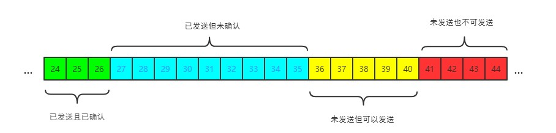

#### TCP篇

##### TCP和UDP的区别

首先概括一下基本的区别：

**TCP**是一个**面向连接**、**可靠的**以及**基于字节流**的传输层协议

而UDP是一个**面向无连接**的传输层协议。

具体分析下TCP的**三大核心特性**

- 面向连接：所谓的连接，指的是客户端和服务器的连接，在双方通信之前，TCP需要通过三次握手建立连接，而UDP没有相应建立连接的过程

- 可靠的：TCP花了许多功夫保证连接的可靠，主要体现在以下两个方面：有状态的，可控制的，那么什么又是有状态的和可控制的呢？

  TCP会精准地记录哪些数据发送了，哪些数据被对方接收了，哪些没有被接收，而且保证数据包按序到达，不允许半点差错，这就是**有状态的**

  同时，当发生丢包或者网络变差，TCP会根据具体情况调整自己的行为，控制自己的发送速度以及重传机制，这就是**可控制的**

- 基于字节流：UDP的数据传输是基于数据报的，这是因为仅仅只是继承了IP层的特性，而TCP为了维护状态，将一个个IP包变成了字节流

##### 三次握手

TCP的三次握手，目的就是为了确保客户端和服务端双方的两样能力：**发送的能力**和**接收的能力**


> 对照上面这张图，我们来分析一下整个过程

- 首先，双方都处于`CLOSED`状态
- 然后服务端开始监听某个端口，进入了`LISTEN`状态
- 接着，客户端主动发起连接，发送`SYN`标志位，表示要建立连接，并发送请求序号`seq`（客户端随机生成的一个起始序列号ISN），自身状态变为`SYN-SENT`
- 服务端接收到后，返回`SYN`（表示要建立连接）和`ACK`（对接收到的信息进行响应），并发送确认号`ack`（值为上一次客户端的请求序号+1）以及请求序号`seq`，同时自身状态变为`SYN-RCVD`
- 客户端收到响应后，再发送ACK，请求序号seq，确认号ack给服务端，自身状态变为`ESTABLISHED`
- 服务端收到响应后，自身状态变为`ESTABLISHED`

另外，从图中可以看出，SYN是需要消耗一个序列号的，下次发送的确认号ack要加1，因为这里有一个规则：

> 凡是需要对端确认的，一定要消耗TCP报文的序列号

SYN需要对端的确认，而ACK并不需要，因此SYN需要消耗一个序列号，而ACK不需要

**为什么需要3次握手，2次不可以吗？**

> 根本原因：无法确认客户端的接收能力

如果只握手两次，客户端发了SYN报文想建立连接，但是这个包滞留在当前的网络迟迟没有到达，于是以为这是丢了包，然后重传，两次握手建立好了连接。

但是连接关闭后，这个滞留的包到达了服务器，这时候，服务器端又再次进行两次握手，服务器端就默认建立了连接，但是，现在客户端已经断开连接了。

这就带来了连接资源的浪费。

**三次握手过程中可以携带数据吗？**

第三次握手的时候可以携带，前面两次不可以。

如果前两次握手能够携带数据，那么一旦有人想攻击服务器，那么他只需要在第一次握手中的` SYN `报文中放大量数据，那么服务器势必会消耗更多的**时间**和**内存空间**去处理这些数据，增大了服务器被攻击的风险。

##### 四次挥手


下面分析一下整个过程

- 刚开始，双方都处于ESTABLISHED状态
- 接着，客户端要断开连接了，发送含FIN标志位，序列号seq的报文，这时客户端变成了FIN-WAIT-1状态，同时客户端也变成了half-close（半关闭）状态，即只能接收，不能发送报文。
- 服务端接收后，立即返回ACK，以及确认号ack，此时服务端处于CLOSED-WAIT状态，客户端处于FIN-WAIT-2状态，当前不是立马给客户端发送FIN报文，这个状态还要持续一段时间，因为服务端可能还有数据没发完。
- 服务端将数据发送完毕后，接着就向客户端发送释放报文，包含FIN，ACK，seq，以及ack（和上次一样），自身状态变为LAST-ACK
- 客户端收到服务端发的FIN报文后，自己变成了TIME-WAIT状态，然后发送ACK给服务端。
- 服务端接收后，变成CLOSED状态，而客户端则需要等待2MSL（报文最大生存时间）才能变成CLOSED状态，在这段时间内，如果客户端没有收到服务端的重发请求，那么表示ACK成功到达，挥手结束，否则重发ACK。

**等待2MSL的意义**

如果不等待，客户端直接进入关闭状态，但服务端还有很多数据包要发给客户端，且还在路上的时候，若客户端的端口此时已经被新的应用占用，那么就会接收到无用数据包，造成数据包混乱。所以最好等服务端发来的数据包都死翘翘再启动新的应用。

那为什么要等待2MSl呢，一个不行吗？

- 一个MSL确保客户端最后的ACK报文最终能到达服务端
- 一个MSL确保服务端由于没有收到ACK，重传的FIN报文可以到达

**为什么是四次挥手，不是三次？**

因为服务端在接收到`FIN`, 往往不会立即返回`FIN`, 必须等到服务端所有的报文都发送完毕了，才能发`FIN`。因此先发一个`ACK`表示已经收到客户端的`FIN`，延迟一段时间才发`FIN`。这就造成了四次挥手。

如果是三次挥手会有什么问题？

等于说服务端将`ACK`和`FIN`的发送合并为一次挥手，这个时候长时间的延迟可能会导致客户端误以为`FIN`没有到达客户端，从而让客户端不断的重发`FIN`。

##### TCP报文头部的字段介绍


如何识别一个连接呢？答案是TCP连接的四元组：源IP，源端口，目标IP，目标端口。由于IP在IP层就已经得到了处理，所以TCP只需要记录端口。

（1）请求序号：seq，占32位，用来标识TCP源端向目的端发送的字节流，发起方发送数据时对此进行标记，保证数据包按序安装。

（2）确认序号：ack，占32位，只有ACK标志位为1时，确认序号字段才有效，ack=seq（接收到的请求序号）+1。

（3）标志位：URG，ACK，PSH，RST，SYN，FIN

- ACK：确认序号有效
- FIN：释放一个连接
- PSH：接收方应该尽快将这个报文交给应用层
- RST：重置连接
- SYN：发起一个新连接
- URG：紧急指针有效

##### TCP的流量控制

对于发送端和接收端而言，TCP需要把发送的数据放到发送缓存区，将接收的数据放到接收缓存区。

而流量控制所要做的事情，就是通过接收缓存区的大小，控制发送端的发送。

要具体了解流量控制，首先需要了解滑动窗口的概念。

**TCP滑动窗口**

**发送窗口**：



其中包含四个部分：

- 已发送且确认
- 已发送但未确认
- 未发送但可以发送
- 未发送且不可以发送


发送窗口就是图中被框住的位置

**接收窗口**：


**流量控制过程：**

首先双方进行三次握手，初始化各自的窗口大小，假设均为200字节

假设当前发送端给接收端发送100个字节，那么对于发送端而言，可用窗口要减少100个字节。

100个字节到了接收端后，被放到接收端的缓冲队列中，不过由于大量负载的原因，接收端处理不了那么多字节，只能处理40个字节，剩下的60个字节被留在了缓冲队列中。

此时我们可以看到，接收端的能力有限，那么就需要告诉发送端，所以此时接收端的接收窗口应该缩小，举个例子，缩小60字节，因为缓冲队列中还有60个字节没被接收，由此接收窗口由200字节变成了140字节。

接着，接收端会在ACK的报文首部带上缩小后的滑动窗口大小，发送端也会因此调整发送窗口为140字节。

对于此时的发送端而言，已经发送且确认的部分增加了40字节，且发送窗口缩小为140字节。

##### TCP的拥塞控制

拥塞窗口指的是目前自己还能传输的数据量大小

上面介绍的**流量控制**是**接收端对发送端的限制**

而这里介绍的**拥塞控制**是**发送端对发送端的限制**

所以发送端到底该听谁的呢？

```javascript
发送端窗口大小 = min(rwnd, cwnd);
```

rwnd为接收窗口，cwnd为拥塞窗口，发送端窗口大小就是取两者的较小值

**慢启动**

刚开始进入数据传输的时候，是不知道当前的网络是稳定的还是拥堵的，如果做的太激进，发包太急，如果当时网络不好，那么会疯狂丢包。

因此，拥塞控制首先就是要采用一种保守的算法来慢慢适应整个网络，这种算法叫：**慢启动**：

- 首先，三次握手，双方宣告自己的接收窗口大小
- 双手初始化自己的拥塞窗口大小
- 在开始传输的一段时间，发送端每收到一个 ACK，拥塞窗口大小加 1，也就是说，每经过一个 RTT，cwnd 翻倍。如果说初始窗口为 10，那么第一轮 10 个报文传完且发送端收到 ACK 后，cwnd 变为 20，第二轮变为 40，第三轮变为 80，依次类推。

难道就这么永无止境地翻倍下去吗？肯定不是啊，它地阈值叫做**慢启动阈值**，当到达阈值后，就得踩刹车了，当然，也不是完成停下。

这就是拥塞避免要做的事情了：

**拥塞避免**

原来每收到一个 ACK，cwnd 加1，现在到达阈值了，cwnd 只能加这么一点: **1 / cwnd**。那你仔细算算，一轮 RTT 下来，收到 cwnd 个 ACK, 那最后拥塞窗口的大小 cwnd 总共才增加 1。

也就是说，以前一个 RTT 下来，`cwnd`翻倍，现在`cwnd`只是增加 1 而已。

**快速重传**

在TCP传输过程中，如果发生了丢包，即接收端发现数据段不是按序到达的，接收端的处理是重复发送之前的ACK。

比如第 5 个包丢了，即使第 6、7 个包到达的接收端，接收端也一律返回第 4 个包的 ACK。当发送端收到 3 个重复的 ACK 时，意识到丢包了，于是马上进行重传。

快速重传解决的是**是否需要重传**的问题

**选择性重传**

你觉得发送端在对第5个包进行重传后，会对第6，7个包也进行重传吗？

此时，第6，7个包都已经达到了，TCP的设计者也不傻，肯定会想到这个问题的，都已经传过去了干嘛还要再传一次呢，干脆记录一下哪些包到了，哪些包没到，针对性地进行重传。

- 在收到发送端的报文后，接收端回复一个 ACK 报文，那么在这个报文首部的可选项中，就可以加上`SACK`这个属性，通过`left edge`和`right edge`告知发送端已经收到了哪些区间的数据报。因此，即使第 5 个包丢包了，当收到第 6、7 个包之后，接收端依然会告诉发送端，这两个包到了。剩下第 5 个包没到，就重传这个包。这个过程也叫做**选择性重传(SACK，Selective Acknowledgment)**，它解决的是**如何重传**的问题。

**快速恢复**

当然，发送端接收到三次重复的ACK后，发现丢包了，觉得现在网络有点拥塞了，自己会进入快速恢复阶段。

在这个阶段，发送端会发生如下改变：

- 拥塞阈值改为原来的一半
- cwmd窗口大小变成拥塞阈值
- cwnd线性增加

以上就是TCP拥塞控制的经典算法：慢启动、拥塞避免、快速重传和快速恢复。

##### Nagle算法和延迟确认

**Nagle算法**

试想一下，如果发送端要发送1000个字节，每次只发送1个字节，那么接收端就需要确认1000次，不觉得这样会造成巨大的时延吗？于是有了Nagle算法，解决的就是：避免小包的频繁发送而造成巨大的时延。

具体规则：

- 当第一次发送的时候，直接立即发送
- 后面的发送满足下面任一条件就可以发送了
  - 数据包大小达到最大段大小（Max Segment Size）
  - 之前所有的包的ACK都已接收到

**延迟确认**

试想一下：如果接收端收到了发送端的一个包，然后短时间内又接收到第二个包，那我是一个个地回复，还是稍微等一下，把两个包的ACK合并后一起回复呢？

延迟确认就是在发送ACK时，稍稍延迟，然后合并ACK，再回复给发送端，TCP要求这个时延必须小于500ms， 此外，以每完整的数据包为一段，ACK报文必须每两段发送一次。

不过，并不是任何场景下都能延迟确认的：

- 接收到了大于一个frame的报文，且需要调整窗口大小
- TCP处于quickack模式（通过tcp_in_quickack_mode设置）
- 发现了乱序包

**两者一起使用会怎么样**

前者意味着延迟发送，后者意味着延迟确认，如果一起使用，会造成更大的时延，产生性能问题。