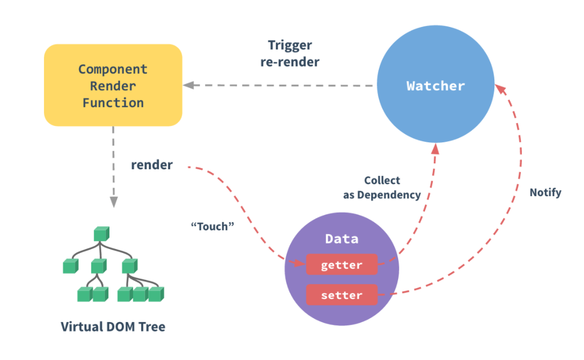

Vue的原理分析<!--more-->

#### Object的变化侦测



在vue2中，采用的是`Object.defineProperty`方法来对数据进行变化侦测

首先，定义一个数据对象：car

```javascript
let car = {
    brand: 'BMW',
    price: 3000
}
```

接下来，我们使用`Object.defineProperty`改写上面的例子：

```javascript
let car = {};
let val = 3000;
Object.defineProperty(car, 'price', {
    enumerable: true,
    configurable: true,
    get() {
        console.log('price属性被读取了');
        return val;
    },
    set(newVal) {
        console.log('price属性被修改了');
        val = newVal;
    }
})
```

```javascript
console.log(car.price);
car.price = 2000;
console.log(car.price);

//price属性被读取了
//3000
//price属性被修改了
//price属性被读取了
//2000
```

可以看到，car已经可以主动告诉我们它的属性的读写情况了，这也意味着，这个car的数据对象已经是可观测的了

为了把car的所有属性变得可观测，我们可以编写如下代码：

```javascript
class Observer {
    constructor(value) {
        this.value = value;
        if(Array.isArray(value)) {
            //当检测对象为数组时的逻辑
        } else {
            this.walk(value);
        }
    }

    walk(object) {
        const keys = Object.keys(object);
        keys.forEach(key => {
            defineReactive(object, key);
        });
    }
};

function defineReactive(object, key, value) {
    // 当参数长度为2时，说明object[key]有初始值，value设置为其初始值
    if(arguments.length == 2) {
        value = object[key];
    }

	//如果该键的值的类型为Object
    if(typeof value === 'object' && value) {
        new Observer(value);
    }

    Object.defineProperty(object, key, {
        enumerable: true,
        configurable: true,
        get() {
            console.log(`${key}属性被读取了`);
            return value;
        },
        set(newValue) {
            console.log(`${key}属性被修改了`);
            value = newValue;
        }
    });
};
```

此时，当我们修改了一个数据之后，如何才能通知视图更新呢？视图更新时，是要把所有视图都更新吗（这样极其浪费性能），还是选择性地更新视图（即谁用到了这个修改的数据，就更新谁），官方文档将这个称为**依赖**，即谁依赖了这个数据，我们就把谁放入该数据的**依赖数组**中，当该数据修改时，通知依赖数组里面的每一个元素，该过程也叫做**依赖收集**。

```javascript
class Dep {
    constructor() {
        this.subs = [];
    }

    addSub(sub) {
        this.subs.push(sub);
    }

    //删除一个依赖
    removeSub(sub) {
        remove(this.subs, sub);
    }

    //添加依赖
    dependSub(sub) {
    	//window.target为一个全局唯一对象，其就是该数据的依赖，也就是后面提出的Watcher实例
        if (window.target) {
            this.addSub(sub);
        }
    }

    // 通知依赖更新
    notify() {
        const subs = this.subs.slice();
        for (let i = 0, l = subs.length; i < l; i++) {
            subs[i].update();
        }
    }
}

function remove(arr, item) {
    const index = arr.indexOf(item);
    if(index === -1) {
        return;
    } else {
        arr.replace(index, 1);
    }
}
```

接下来，就是要知道在哪里收集依赖，在哪里通知依赖更新了，其实这个问题在前面已经回答了：谁用到了这个数据，那么当这个数据变化时就通知谁。所谓谁用到了这个数据，其实就是谁获取了这个数据，而可观测的数据被获取时会触发`getter`属性，那么我们就可以在`getter`中收集这个依赖。同样，当这个数据变化时会触发`setter`属性，那么我们就可以在`setter`中通知依赖更新。

即：**在getter中收集依赖，在setter中通知依赖更新**

即我们要在原来的Observer类的defineReactive函数基础上进行完善：

```javascript
function defineReactive(object, key, value) {
    // 当参数长度为2时，说明object[key]有初始值，value设置为其初始值
    if(arguments.length == 2) {
        value = object[key];
    }

	//如果该键的值的类型为Object
    if(typeof value === 'object' && value) {
        new Observer(value);
    }
	
	const dep = new Dep();		//创建Dep实例
    Object.defineProperty(object, key, {
        enumerable: true,
        configurable: true,
        get() {
        	dep.depend();		//收集依赖
            console.log(`${key}属性被读取了`);
            return value;
        },
        set(newValue) {
        	dep.notify();		//通知依赖更新
            console.log(`${key}属性被修改了`);
            value = newValue;
        }
    });
};
```

好了，现在基本内容都差不多，那么问题来了，到底依赖是谁？

Vue借鉴了MVVM模式，要实现这个View-Model层，Vue引入了Watcher类，其实也可以将Watcher类的实例看作是上面说的依赖，换句话说就是：谁用到了数据，谁就是依赖，我们就为谁创建一个`Watcher`实例。在之后数据变化时，我们不直接去通知依赖更新，而是通知依赖对应的`Watch`实例，由`Watcher`实例去通知真正的视图。

```javascript
class Watcher {
  constructor (vm,expOrFn,cb) {
    this.vm = vm;
    //如果有回调函数，则保存
    this.cb = cb;
    //解析路径
    this.getter = parsePath(expOrFn);
    //调用get函数，触发getter函数，将该Watcher实例放入Dep仓库中
    this.value = this.get();
  }
  get () {
    window.target = this;
    const vm = this.vm
    let value = this.getter.call(vm, vm)
    window.target = undefined;
    return value
  }
  update () {
    const oldValue = this.value;
    this.value = this.get();
    this.cb.call(this.vm, this.value, oldValue);
  }
}

/**
 * Parse simple path.
 * 把一个形如'data.a.b.c'的字符串路径所表示的值，从真实的data对象中取出来
 * 例如：
 * data = {a:{b:{c:2}}}
 * parsePath('a.b.c')(data)  // 2
 */
const bailRE = /[^\w.$]/
export function parsePath (path) {
  if (bailRE.test(path)) {
    return;
  }
  const segments = path.split('.');
  return function (obj) {
    for (let i = 0; i < segments.length; i++) {
      if (!obj) return;
      obj = obj[segments[i]];
    }
    return obj;
  }
}
```

下面分析一下Watcher类的实现逻辑

- 当创建Watcher类实例时，会执行其构造函数
- 在构造函数中，会执行**get**函数
- 在get函数中，首先会将该watcher实例放到全局的唯一对象window.target中，然后调用该实例的getter函数，从而进行依赖收集，而在依赖收集函数depend中，又会将该watcher实例放入依赖数组中，最后将window.target释放掉
- 当数据发生变化时，又会触发数据的setter，然后执行notify函数，通知依赖数组中的每一个watcher实例更新，即调用watcher实例的update函数

**总结**：

- 首先，通过`Object.defineProperty`方法实现了对`object`数据的检测，并且封装了Observer类，将`object`数据中的所有属性都转换为可监测的
- 紧接着，定义了`Dep`类，会为每一个监听的数据创建一个`dep`实例，其在`getter`中收集依赖，在`setter`中通知依赖更新
- 当外界通过`Watcher`读取数据时，会执行里面的`get`函数，而get函数里面则执行了`getter`函数，从而进行依赖（即Watcher实例）的收集
- 当数据发生改变了，`setter`会调用`notify`函数，通知每一个`watcher`实例执行`update`函数，进行更新
- `Watcher`收到通知后，会向外界发出通知，触发视图更新，也可能触发用户执行某个回调函数

#### Array的变化侦测

对于`Object`数据我们可以使用`Object.defineProperty`来进行数据监测，但是，Array原型对象上没有这个方法，因此需要另外一套监测机制。

首先，我们要确定在哪里收集依赖，其实`Array`型数据还是在`getter`中收集依赖，这时候，很多人就纳闷了，不就刚刚才说完`Array`型数据没有`Object.defineProperty`方法吗？但是，我们想想一下，平常在开发过程中，组件中的`data`是怎么写的：

```javascript
data() {
    return {
        arr: [1, 2, 3]
    }
}
```

我们可以看到：`arr`是`data`返回的一个`object`数据对象的一个属性，因此，当我们要获得该数据时，`object.arr`不就调用了`arr`的`getter`函数（至于`arr`数组里面的元素，等会会讲），所以我们就可以在`getter`中收集依赖。

上面我们已经知道了`arr`何时被读取了，接下来，我们需要知道，`arr`何时被修改了

想要让`Array`型数据发生变化，那必然是对数组进行操作，`Array`原型中可以改变自身的方法有七个：`push`,`pop`,`shift`,`unshift`,`splice`,`sort`,`reverse`

那我们想要知道该数据什么时候调用这些方法时，可以对其进行**拦截**，源码中的拦截器代码如下：

```javascript
const arrayProto = Array.prototype;
//创建一个对象作为拦截器
export const arrayMethods = Object.create(arrayProto);

//改变数组自身的七个方法
const methodsToPatch = ['push', 'pop', 'shift', 'unshift', 'splice', 'sort', 'reverse'];

methodsToPatch.forEach(function(method) {
    const original = arrayProto[method]; //缓存原生方法
    Object.defineProperty(arrayMethods, method, {
        enumerable: false,
        configurable: true,
        writable: true,
        value: function mutator(...args) {
            const result = original.apply(this, args);
            return result;
        }
    })
})
```

刚刚我们只是把拦截器创建好了，要对数组调用原生方法进行拦截，我们还要把这个拦截器挂载到数组实例与`Array.prototype`之间，这样拦截器才能够生效

我们只需要将数据的`__proto__`属性设置为拦截器`arrayMethods`就行了，源码如下：

```javascript
export class Observer {
    constructor(value) {
        this.value = value;
        if(Array.isArray(value)) {
        	//获取拦截函数
            const augment = hasProto 
            	? protoAument
            	: copyAument;
            //执行拦截函数
            augment(value, arrayMethods, arrayKeys);
        } else {
            this.walk();
        }
    }
}

//判断__proto__是否可用
const hasProto = '__proto__' in {};

const arrayKeys = Object.getOwnPropertyNames(arrayMethods);

function protoAument(target, src, keys) {
    target.__proto__ = src;
}

function copyAugment(target, src, keys) {
    for (let i = 0; i < keys.length; i++) {
        const key = keys[i];
        def(target, key, src[key]);
    }
}
```

接下来，为每个`Observer`类实例添加一个依赖管理器，接着就是讨论如何收集依赖了，依赖管理器定义在`Observer`类中，也就是说我们如何在`getter`访问到这个类实例的方法，源码如下：

```javascript
function defineReactive(obj,key,val) {
  //获取当前实例
  let childOb = observe(val)
  Object.defineProperty(obj, key, {
    enumerable: true,
    configurable: true,
    get(){
      if(childOb) {
        childOb.dep.depend()
      }
      return val;
    },
    set(newVal){
      if(val === newVal){
        return
      }
      val = newVal;
      dep.notify()   // 在setter中通知依赖更新
    }
  })
}
//获取类实例
export function observe(value, asRootData){
  if(!isObject(value) || value instanceof VNode) {
    return；
  }
  let ob；
  if (hasOwn(value, '__ob__') && value.__ob__ instanceof Observer) {
    ob = value.__ob__；
  } else {
    ob = new Observer(value)；
  }
  return ob；
}
```

在上面代码中，我们首先通过`observe`函数为被获取的数据`arr`尝试创建一个`Observer`实例，在`observe`函数内部，先判断当前传入的数据上是否有`__ob__`属性，因为在上篇文章中说了，如果数据有`__ob__`属性，表示它已经被转化成响应式的了，如果没有则表示该数据还不是响应式的，那么就调用`new Observer(value)`将其转化成响应式的，并把数据对应的`Observer`实例返回。

而在`defineReactive`函数中，首先获取数据对应的`Observer`实例`childOb`，然后在`getter`中调用`Observer`实例上依赖管理器，从而将依赖收集起来。

然后就是通知依赖更新了，就在之前我们写过的拦截器上做一点修改，在调用每一个函数时，说明数据进行修改了，则通知依赖更新：

```javascript
methodsToPatch.forEach(function (method) {
  const original = arrayProto[method];
  def(arrayMethods, method, function mutator (...args) {
    const result = original.apply(this, args);
    const ob = this.__ob__;
    // 通知依赖更新
    ob.dep.notify();
    return result;
  })
})
```

接下来就是深度侦测，也就是将数组里面的元素进行监测，还有对新增元素的侦测，这个的实现比较简单，就是对目前侦测的数组对象里面的元素进行遍历，同时将其进行侦测处理，并在拦截时，判断拦截的方法，如果是`push`,`unshift`以及`splice`的话，则对新增元素进行侦听处理。

**不足之处：**

当然，这种拦截方法也是存在缺陷的，我们只是对数组的方法进行了拦截，然而，我们还可以通过`array.length`或者`array[i] `来对数组进行修改，目前是无法对其进行监听的。

而使用上述例子中的操作方式来修改数组是无法侦测到的。 同样，`Vue`也注意到了这个问题， 为了解决这一问题，`Vue`增加了两个全局API:`Vue.set`和`Vue.delete`，这两个API的实现原理将会在后面学习全局API的时候说到。

#### 虚拟DOM篇

